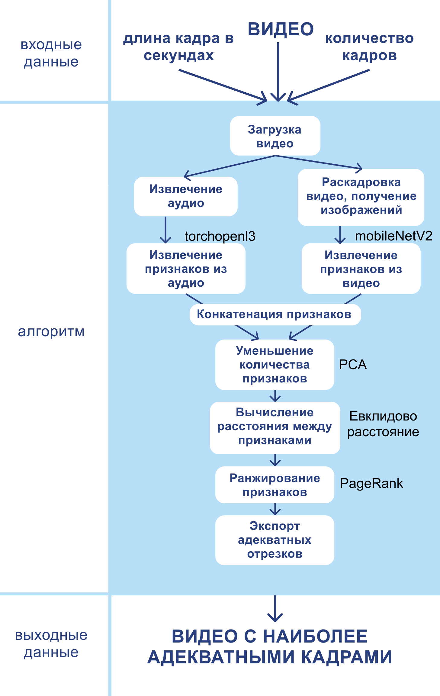
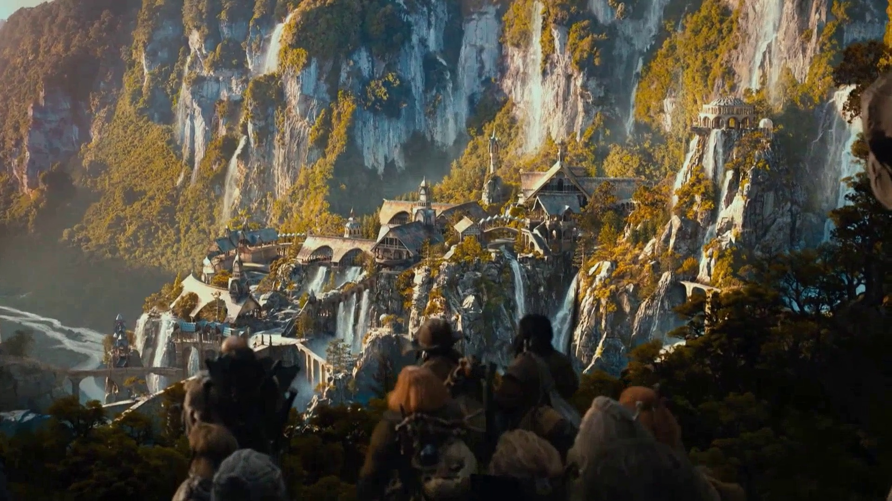
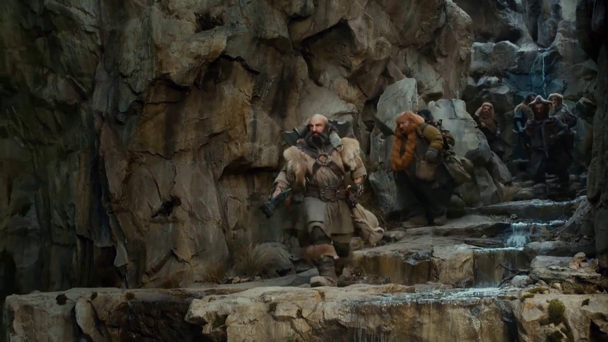
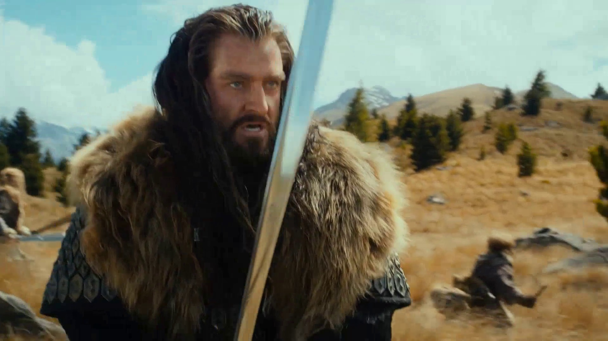
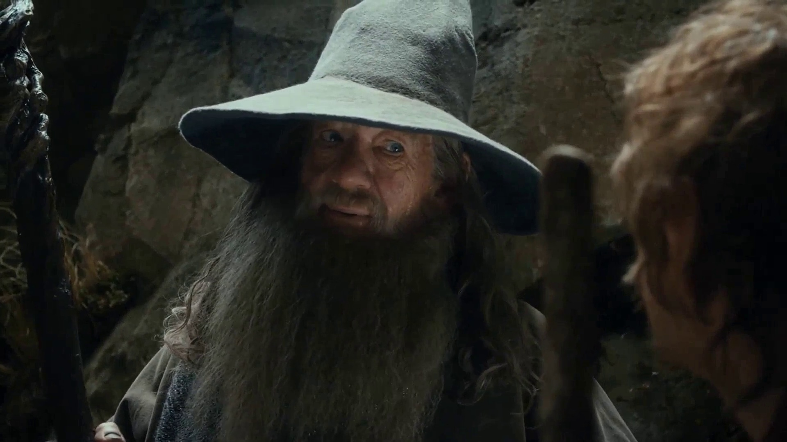
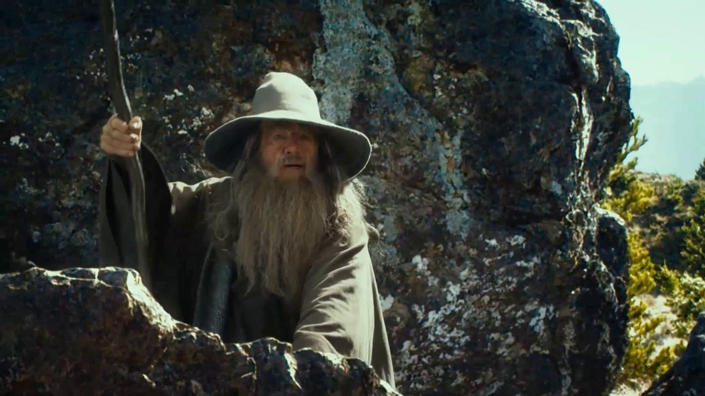

# typical_frame
Python algorythm, analyses video and gives the most typical frames of the video.

Данная работа будет **актуальна** для онлайн-кинотеатров. Они могут использовать найденные изображения для создания превью к базе видеофильмов, а так же характерных слайдов фильма, которые мы неоднократно видим в каждом онлайн-кинотеатре.
**Объект исследования:** видеозаписи со звуком.
**Предмет исследования:** поиск наиболее важных видеофрагментов в видеозаписи методами машинного обучения.
**Цель работы:** определение наиболее адекватных кадров в видеозаписи методами машинного обучения
**Задачи:**
1) сделать обзор способов решения задачи методами машинного обучения;
2) выбрать архитектуру модели и алгоритм решения задачи;
3) выбрать данные для обучения и отладки алгоритма;
4) написать и отладить алгоритм;
5) проверить качество получаемых результатов.

**Рисунок алгоритма:**

 

Для проверки результата использовался 3-минутный кадр из фильма «Хоббит: Нежданное путешествие» 2012.

В результате выполнения программы были получены 5 адекватных кадров по убыванию адекватности. Для показа результата в данной работе были вырезаны 5 кадров из каждого 10 секундного видео.

**Первый кадр**

 

ожидаемый, самый красочный в данном видео ряде.

**Второй кадр**

 

— момент до того, как они подошли к городу.

**Третий кадр** 

 

— битва.

**Четвертый кадр** 

 

— разговор Гендальфа с Хоббитом:
- Это похоже на магию.
- Ты совершенно прав мой друг, это очень могущественная магия.

**Пятый кадр**

 

 — во время битвы Гендальф неожиданно появился из-за камня, где до этого не было никого и позвал всех в пещеру.

Данные результаты полностью совпали с ожиданием.